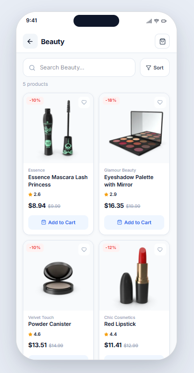

# 🛒 NOVA Store

A modern, responsive Flutter e-commerce application showcasing products across multiple categories with an intuitive user interface and smooth user experience.

---

## 📱 Preview


---

## ✨ Features

- 🏠 **Home Screen** - Personalized greeting and dashboard
- 📂 **Product Categories** - Browse products by categories (Beauty, Fragrances, Furniture, etc.)
- 🛍️ **Featured Products** - Curated product grid with image, name, and pricing
- ⭐ **Product Ratings** - Display product ratings and reviews
- 💰 **Price Display** - Show original and discounted prices
- 🔍 **Search Bar** - Quick product search functionality
- 🎨 **Responsive UI** - Beautiful Material Design 3 interface
- 📱 **Multi-Platform** - Support for Android and iOS

---

## 🛠️ Tech Stack

| Technology | Purpose |
|-----------|---------|
| **Flutter** | Cross-platform mobile framework |
| **Dart 3.9.2** | Programming language |
| **Material Design 3** | UI design system |
| **flutter_svg** | SVG asset rendering |
| **cupertino_icons** | iOS-style icons |

---

## 📦 Packages

| Package | Version | Purpose |
|---------|---------|---------|
| `cupertino_icons` | ^1.0.8 | iOS-style icons library |
| `flutter_svg` | ^2.3.0 | SVG rendering support |
| `flutter_lints` | ^5.0.0 | Dart code quality analysis |

---

## 🏗️ Project Structure

```
nova_app/
├── lib/
│   ├── main.dart                 # App entry point
│   ├── home_screen.dart          # Main home screen with layout
│   ├── categories_section.dart   # Categories list component
│   └── products_section.dart     # Featured products grid component
├── android/                      # Android-specific configuration
├── ios/                          # iOS-specific configuration
├── test/                         # Widget tests
├── pubspec.yaml                  # Project dependencies
├── analysis_options.yaml         # Dart lint rules
└── README.md                     # Project documentation
```

---

## 🎯 Architecture

The application follows a **simple Widget-based architecture** with modular UI components:

- **Modular Widgets**: Reusable UI components (CategoriesSection, ProductsSection)
- **Stateless Components**: Immutable widgets for better performance
- **Single Screen Flow**: Currently features a single main screen (HomeScreen) with nested widgets

This architecture is lightweight and suitable for MVP-stage applications. Future enhancements can incorporate state management patterns like BLoC or Cubit for scalability.

---

## 📚 Screens

### Home Screen
- **Path**: `lib/home_screen.dart`
- **Description**: Main application screen featuring app bar with notifications and profile, search functionality, product categories carousel, and featured products grid
- **Components**: 
  - AppBar with actions
  - Search TextField
  - CategoriesSection
  - ProductsSection

### Categories Section
- **Path**: `lib/categories_section.dart`
- **Description**: Horizontal scrollable list of product categories including Beauty, Fragrances, and Furniture

### Products Section
- **Path**: `lib/products_section.dart`
- **Description**: Grid layout displaying featured products with images, ratings, and pricing information

---

## 🔌 Dependencies & Installation

### Prerequisites
- Flutter SDK (≥3.9.2)
- Dart SDK (≥3.9.2)
- Android Studio or Xcode (for emulator/simulator)

### Installation Steps

1. **Clone the repository**
   ```bash
   git clone <repository-url>
   cd nova_app
   ```

2. **Install dependencies**
   ```bash
   flutter pub get
   ```

3. **Generate localizations and build files** (if needed)
   ```bash
   flutter gen-l10n
   flutter pub run build_runner build
   ```

4. **Run the application**

   **On Android Emulator:**
   ```bash
   flutter run
   ```

   **On iOS Simulator:**
   ```bash
   flutter run -i
   ```

   **On Physical Device:**
   ```bash
   flutter run
   ```

5. **Build for Production**

   **Android APK:**
   ```bash
   flutter build apk --release
   ```

   **Android App Bundle:**
   ```bash
   flutter build appbundle --release
   ```

   **iOS:**
   ```bash
   flutter build ios --release
   ```


---

## 🎨 UI/UX Highlights

- **Material Design 3**: Modern and clean interface following latest Material Design guidelines
- **Responsive Layout**: Adaptive UI that works across different screen sizes
- **Color Scheme**: Professional blue (#2563EB) accent color with white and gray backgrounds
- **Typography**: Clear hierarchy with bold headers and readable body text
- **Icons**: Material Icons for intuitive navigation and status indicators
- **Images**: Network image loading from external sources for product display

---

## 🚀 Future Improvements

- 🔐 **Authentication System**: User login, registration, and account management
- 🛒 **Shopping Cart**: Add/remove items, cart management, and checkout flow
- 💳 **Payment Integration**: Secure payment gateway integration (Stripe, PayPal, etc.)
- 🔄 **State Management**: Implement BLoC or Cubit for advanced state management
- 📡 **API Integration**: Connect to backend API for real product data
- 💾 **Local Database**: SQLite or Hive for offline data persistence
- 🔍 **Advanced Search**: Full-text search with filters and sorting
- ⭐ **Wishlist Feature**: Save favorite products for later
- 💬 **User Reviews**: Product ratings and review system
- 🌙 **Dark Theme**: Support for light and dark modes
- 🌍 **Localization**: Multi-language support (i18n)
- 📊 **Analytics**: Integration with Firebase or similar analytics platform
- 🔔 **Push Notifications**: Real-time order and promotional notifications
- 📦 **Order History**: Track past orders and reorder functionality
- 👤 **User Profile**: Manage addresses, preferences, and account settings

---

## 📖 Code Quality

- **Linting**: Code follows [Flutter Lints](https://pub.dev/packages/flutter_lints) rules
- **Analysis**: Run code analysis with `flutter analyze`
- **Formatting**: Code formatted with `flutter format .`

---

## 📝 License

This project is open source and available under the [MIT License](LICENSE).

---

## 👤 Author

**GitHub**: [KarimTamer74](https://github.com/TODO_GITHUB_USERNAME)

**Email**: karimabokamel74@gmail.com

---

## 📞 Support

For issues, suggestions, or contributions, please open an [Issue](https://github.com/TODO_GITHUB_USERNAME/nova_app/issues) or submit a [Pull Request](https://github.com/TODO_GITHUB_USERNAME/nova_app/pulls).

---

## 🙏 Acknowledgments

- [Flutter Documentation](https://flutter.dev)
- [Material Design 3](https://m3.material.io/)
- [Dart Language](https://dart.dev)
- Icons and design inspiration from modern e-commerce applications

---

**Last Updated**: June 2026  
**Flutter Version**: 3.9.2+  
**Dart Version**: 3.9.2+
